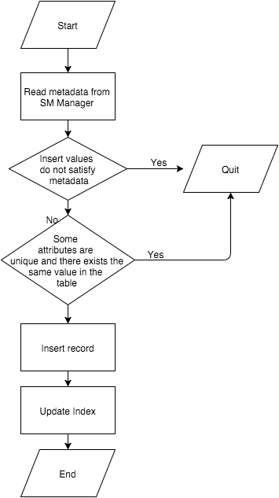
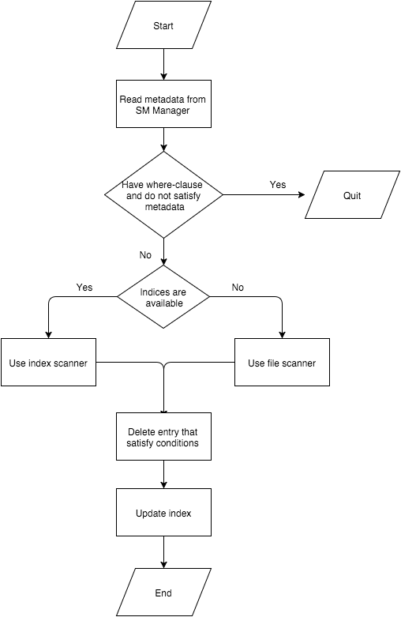

# API

熊郁文 3130000829

## 实验需求

API模块是整个系统的核心，其主要功能为提供执行SQL语句的接口，供Interpreter层调用。该接口以Interpreter层解释生成的命令内部表示为输入，根据Catalog Manager提供的信息确定执行规则，并调用Record Manager、Index Manager和Catalog Manager提供的相应接口进行执行，最后返回执行结果给Interpreter模块。

## 实验原理

在我们的实现中，API部分与实验指导有少许差别，由于Interpreter部分由lex/yacc实现，API部分实际上是调用了yyparse函数来获得Interpreter文档中提到的State struct变量，然后根据state变量来获取语句信息，来判断应该调用哪个模块，具体逻辑如下：

```c++
if (parseState.type == EXIT) {
    smm.CloseDb();
break;
}
switch (parseState.type) {
    case CREATETABLE:
        if ((rc = smm.CreateTable(parseState.relationName, parseState.attrs))) {
        	ERROR PROCESSING...
        }
        break;
    case DROPTABLE:
        if ((rc = smm.DropTable(parseState.relationName))) {
        	ERROR PROCESSING...
        }
        break;
    case CREATEINDEX:
        if ((rc = smm.CreateIndex(parseState.relationName, 
        						  parseState.attrName, parseState.indexName))) {
        	ERROR PROCESSING...
            }
        }
        break;
    case DROPINDEX:
        if ((rc = smm.DropIndex(parseState.indexName))) {
        	ERROR PROCESSING...
        }
        break;
    case SELECT:
        if ((rc = qlm.Select(parseState.relationName, parseState.conditions))) {
        	ERROR PROCESSING...
        }
        break;
    case INSERT:
        if ((rc = qlm.Insert(parseState.relationName, parseState.values))) {
        	ERROR PROCESSING...
        }
        break;
    case DELETE:
        if ((rc = qlm.Delete(parseState.relationName, parseState.conditions))) {
        	ERROR PROCESSING...
        }
        break;
}

```

其中Select Insert Delete三项功能由我来完成，Create Table, Drop Table, Create Index, Drop Index由杜启明所写的Catalog Manager来完成。下面我将一一介绍Select、Insert，Delete功能的实现。其他功能将在Catalog Manager部分介绍

###Select功能的大致流程如下：

<center></center>

首先从SM Manager中读取元数据，判断where clause中的条件是否是正确的（即属性名和对应的类型是否符合）。如果没有condition或者是不存在索引，那将会调用RM Manager中的FileScan做全文件扫描。如果where clause中有condition对应的属性是已经建立了索引的，那将会调用IX Manager中的IndexScan做B+树上的扫描。之后再利用剩下的条件做结果的过滤，最后将结果输出即可。

###Insert功能的大致流程如下：

<center></center>

首先从SM Manager中读取元数据，判断要插入的值是否满足表的定义（插入的值的数量与类型）。如果属性被声明为primary与unique，还需要扫描原表（使用IndexScan或FileScan）来判断是否已有相同值在表中，在插入之后，还需要对各个属性的index（如果存在的话）进行更新。


###Delete功能的大致流程如下：

<center></center>

与Select类似，首先从SM Manager中读取元数据，判断where clause的合法性以及使用index scanner或file scanner, 判断扫描到的entry是否满足所有条件，如果满足的话删除此entry，然后更新index。

