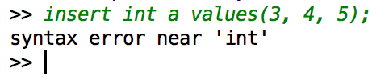

#Interpreter

熊郁文 3130000829

##需求说明
Interpreter模块直接与用户交互，主要实现以下功能：

1. 程序流程控制，即“启动并初始化  ‘接收命令、处理命令、显示命令结果’循环  退出”流程。
2. 接收并解释用户输入的命令，生成命令的内部数据结构表示，同时检查命令的语法正确性和语义正确性，对正确的命令调用API层提供的函数执行并显示执行结果，对不正确的命令显示错误信息。

由实验要求，程序应能实现以下各SQL语句：

- 创建表语句

```sql
CREATE TABLE 表名 (
列名 类型
列名 类型
...
PRIMARY KEY (列名)
);
```
删除表语句

```sql
DROP TABLE 表名；
```

创建索引语句

```sql
CRATE INDEX 索引名 ON 表名 (列名);
```

删除索引语句

```sql
DROP INDEX 索引名；
```

选择语句

```sql
SELECT * FROM 表名;
or 
SELECT * FROM 表名 WHERE 条件;
```
插入记录语句

```sql
INSERT INTO 表名 VALUES (值1，值2, ...,值n);
```

删除记录语句

```sql
DELETE FORM 表名;
or
DELETE FORM 表名 WHERE 条件;
```

退出MiniSQL系统语句

```sql
QUIT;
```

执行SQL脚本文件语句

```sql
EXECFILE 脚本文件名；
```

##实现原理
为了快速，高效的实现Interpreter，我们使用了lex/yacc词法分析和语法分析工具来自动生成解析器。我在Lex文件中定义了SQL系统所需要关键字，Lex生成的c程序会从yyin所指向的流中识别出对应的token，并将识别到的数字，标识符等传给yacc，yacc通过我声明的BNF范式来进行相应的动作。至于SQL的BNF定义我们可从网上查阅或根据课程要求自行设计。


##实现细节
为了简化实现，我们没有采取构建语法树的方式而是定义了一个能够完整表达语句信息的结构体，结构体定义如下：

```c++
typedef enum {
    CREATETABLE,
    DROPTABLE,
    CREATEINDEX,
    DROPINDEX,
    SELECT,
    INSERT,
    DELETE,
    EXIT,
    EMPTY,
    ATTR,
    VALUE
} nodeType;

struct State {
    nodeType type;
    string relationName;
    string indexName;
    string attrName;
    vector<AttrInfo> attrs;
    vector<Value> values;
    vector<Condition> conditions;
    void clear() {
        attrs.clear();
        values.clear();
        conditions.clear();
    }
};
```
yacc在解析SQL语句时将会使用上述结构体来记录信息，在解析完成时将数据赋值给我们在外部定义的一个State实例以供API模块使用。

在lex/yacc解析SQL语句时，如果当前语句匹配失败（即无法满足yy.y中定义的任何BNF语句）那将会进入报错阶段，为了不生硬的提示syntax error而是能够提示错误产生点，在当前语句第一次匹配失败进入错误处理函数以后我会持续读取输入直到读入分号（即当前语句结束）为止，然后输出第一次匹配失败的单词，结果如下图所示：

在匹配失败以后，程序并不结束而是等待新一轮输入。

当处理到execfile命令以后，Interpre将会试图打开指定的文件并讲yyin定向到对应的文件进行解析，如打开失败会进行提示。


鉴于lex/yacc的工作原理和方式以及Interpreter的具体实现（cpp代码均为自动生成）并非本次实验的重点，在此我们就不详细介绍了，以上就是Interpreter的设计报告
